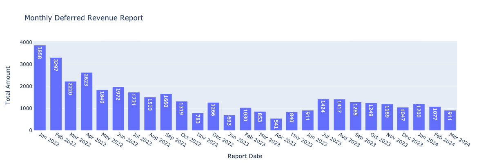
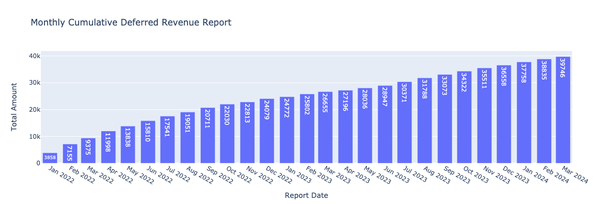
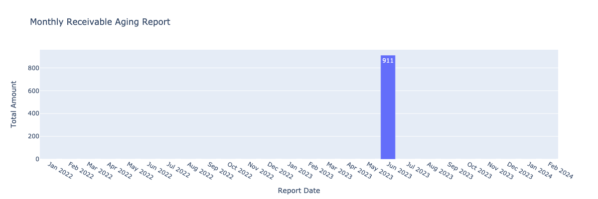

## dbt PROJECT

### Prerequisites
Before you begin, make sure you have the following:

1) Make sure **Python 3.12.3** installed
```bash
python3 --version
```
2) Make sure the latest version of **pip** installed by running the command
```bash
pip3 --version
```
3) Make sure **git** is installed
```bash
git --version
```

4) Create a project folder:
```bash
mkdir dbt_project
cd dbt_project
```
5) Create a new venv:
```bash
python -m venv dbt-env
```
6) Activate that same virtual environment each time you create a shell window or session:
```bash
source dbt-env/bin/activate         # activate the environment for Mac and Linux OR
dbt-env\Scripts\Activate.ps1           # activate the environment for Windows
```
7) Clone the repo:
```zsh
git clone https://github.com/andreyhakobyan/scentbird.git
```
8) Install requirements:
```zsh
pip install -r requirements.txt
```
9) Create **profiles.yaml** in project root folder
```yaml
scentbird:
  target: <target>
  outputs:
    test:
      dbname: <dbname>
      host: <host>
      user: <user>
      password: <password>
      port: <port>
      schema: <schema>
      threads: <threads>
```
10) To make sure **profiles.yaml** is correct, run the following command:
```zsh
dbt --version
dbt debug
```


# Reports
### Monthly Deferred Revenue Report

### Monthly Cumulative Deferred Revenue Report

### Monthly Receivable Aging Report


### Documentations
* [dbt documentation](https://docs.getdbt.com/)
* [SQLFluff documentation](https://docs.sqlfluff.com/en/stable/configuration.html)
* [yamllint documentation](https://yamllint.readthedocs.io/en/stable/)
